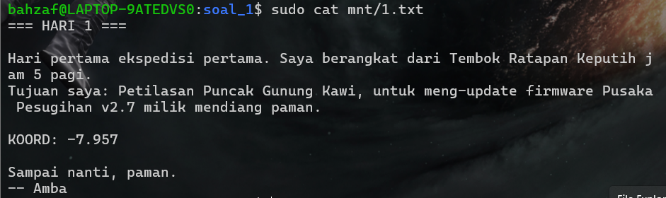
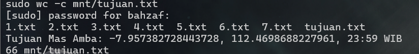
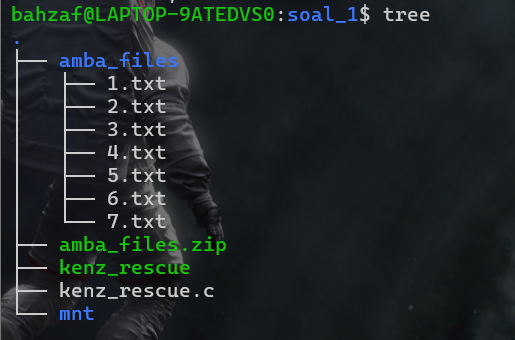
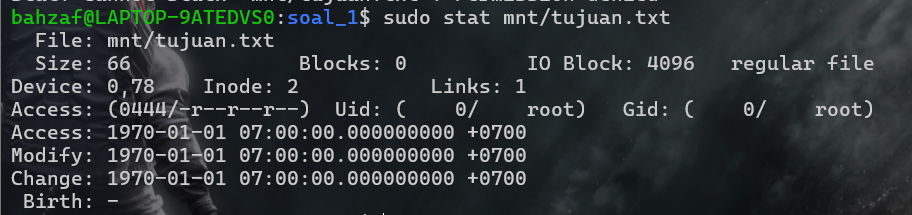
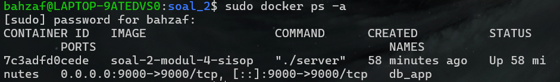
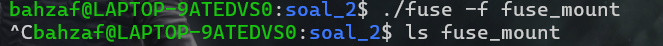
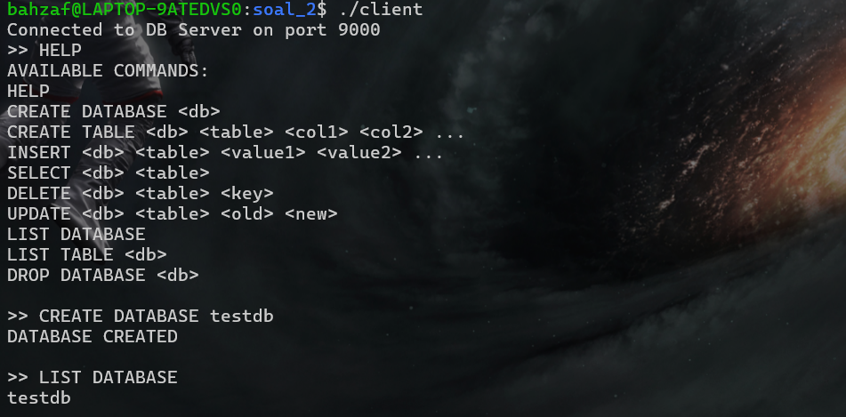

# SISOP-4-2026-IT-023
# LAPORAN

## SOAL 1

### Save Asisten Kenz

Program `kenz_rescue.c` dibuat menggunakan FUSE (Filesystem in Userspace) untuk membuat filesystem virtual yang melakukan passthrough file dari directory sumber `amba_files` ke mount directory `mnt`. Filesystem juga menambahkan virtual file `tujuan.txt` yang dibuat secara on-the-fly tanpa disimpan secara fisik di source directory.

`Poin 1 - Membaca file asli menggunakan passthrough`

Filesystem dibuat agar file `1.txt` hingga `7.txt` yang berada pada directory `amba_files` dapat diakses langsung melalui mount directory `mnt` dengan isi yang identik. Proses passthrough dilakukan menggunakan callback `getattr`, `readdir`, `open`, dan `read`.

Pada callback `read`, file asli dibuka menggunakan `open()` kemudian isi file dibaca menggunakan `pread()` sehingga seluruh isi file pada mount directory sama persis dengan file source.

```c
int fd = open(fullpath, O_RDONLY);

if (fd == -1)
    return -errno;

int res = pread(fd, buf, size, offset);

if (res == -1)
    res = -errno;

close(fd);

return res;
```

`Poin 2 - Menampilkan file pada mount directory`

Callback `readdir` digunakan untuk membaca seluruh isi directory source kemudian menampilkannya pada mountpoint `mnt`. Program menggunakan `opendir()` dan `readdir()` untuk membaca file satu per satu kemudian memasukkannya ke filesystem virtual menggunakan `filler()`.

```c
dp = opendir(fullpath);

while ((de = readdir(dp)) != NULL)
{
    filler(buf, de->d_name, NULL, 0, 0);
}
```

Selain file asli, callback `readdir` juga menambahkan virtual file `tujuan.txt`.

```c
filler(buf, "tujuan.txt", NULL, 0, 0);
```

`Poin 3 - Virtual file tujuan.txt`

Filesystem menambahkan file virtual bernama `tujuan.txt` yang tidak benar-benar ada pada source directory `amba_files`. File ini hanya muncul pada mount directory `mnt`.

Pada callback `getattr`, file virtual dikenali menggunakan pengecekan path.

```c
if (strcmp(path, "/tujuan.txt") == 0)
{
    stbuf->st_mode = S_IFREG | 0444;
    stbuf->st_nlink = 1;
    stbuf->st_size = 66;
    return 0;
}
```

`Poin 4 - Generate isi file secara on-the-fly`

Isi dari `tujuan.txt` tidak disimpan di disk, melainkan dibuat saat file dibaca menggunakan callback `read`. Program membaca seluruh file `1.txt` hingga `7.txt`, mencari fragment yang diawali dengan keyword `KOORD:`, kemudian menggabungkannya menjadi satu string tujuan akhir.

```c
for (int i = 1; i <= 7; i++)
{
    snprintf(filepath,
             sizeof(filepath),
             "%s/%d.txt",
             source_dir,
             i);

    FILE *fp = fopen(filepath, "r");

    while (fgets(line, sizeof(line), fp))
    {
        char *found = strstr(line, "KOORD:");

        if (found != NULL)
        {
            ...
        }
    }

    fclose(fp);
}
```

`Poin 5 - Menghapus newline dan spasi fragment koordinat`

Setelah menemukan fragment `KOORD:`, program menghapus spasi depan dan karakter newline agar seluruh fragment koordinat dapat tergabung dengan rapi menjadi satu kalimat utuh.

```c
char *start = found + 6;

while (*start == ' ')
{
    start++;
}

strcpy(temp, start);

temp[strcspn(temp, "\n")] = 0;

strcat(result, temp);
```

`Poin 6 - Menggunakan snprintf() untuk keamanan buffer`

Seluruh proses pembuatan path menggunakan `snprintf()` agar ukuran buffer tetap aman dan menghindari overflow.

```c
snprintf(fullpath,
         sizeof(fullpath),
         "%s%s",
         source_dir,
         path);
```

`Poin 7 - Menjalankan filesystem FUSE`

Filesystem dijalankan menggunakan mode foreground, debug, dan single-thread agar lebih stabil pada environment WSL.

```bash
sudo ./kenz_rescue -f -d -s mnt
```

Keterangan:

* `-f` : foreground mode
* `-d` : debug mode
* `-s` : single-thread mode

---

### REVISI

Sebelumnya isi `tujuan.txt` masih menghasilkan format yang salah karena fragment koordinat masih mengandung leading space dan newline sehingga output menjadi terpisah-pisah dan jumlah karakter tidak sesuai dengan indikator soal (`wc -c = 66`).

`Before`

```c
strcpy(temp, found + 6);

temp[strcspn(temp, "\n")] = 0;

strcat(result, temp);
```

Masalah:

* masih mengambil spasi setelah `KOORD:`
* output koordinat menjadi tidak rapi
* jumlah karakter tidak sesuai

`After`

```c
char *start = found + 6;

while (*start == ' ')
{
    start++;
}

strcpy(temp, start);

temp[strcspn(temp, "\n")] = 0;

strcat(result, temp);
```

Perbaikan:

* menghapus leading space
* menghapus newline
* hasil koordinat menjadi satu baris utuh
* output sesuai indikator soal (`66 byte`)

---

## OUTPUT SOAL 1

`Mount directory berhasil muncul`

```bash id="rm0lpc"
sudo ls mnt
```

Output:

1.txt
2.txt
3.txt
4.txt
5.txt
6.txt
7.txt
tujuan.txt


---

`Test passthrough file`

```bash id="zc3dnr"
sudo cat mnt/1.txt
```

Output file identik dengan source `amba_files/1.txt`.



---

`Test virtual file`

```bash id="zcb1bh"
sudo cat mnt/tujuan.txt
```

Output:

Tujuan Mas Amba: -7.957382728443728,112.4698688227961,23:59 WIB


---

`Test ukuran file virtual`

```bash id="qkdnr5"
sudo wc -c mnt/tujuan.txt
```

Output:

66 mnt/tujuan.txt



---

`Struktur folder saat runtime`

```bash id="icoc0n"
tree
```

Output:

.
├── amba_files
│   ├── 1.txt
│   ├── 2.txt
│   ├── 3.txt
│   ├── 4.txt
│   ├── 5.txt
│   ├── 6.txt
│   └── 7.txt
├── kenz_rescue
├── kenz_rescue.c
└── mnt



`Test source directory tetap`

```bash id="out1"
ls amba_files
```

Output:

1.txt
2.txt
3.txt
4.txt
5.txt
6.txt
7.txt

Hal ini menunjukkan bahwa file virtual `tujuan.txt` tidak benar-benar dibuat pada source directory.


---

`Test metadata virtual file`

```bash id="out2"
sudo stat mnt/tujuan.txt
```

Output menunjukkan bahwa `tujuan.txt` berhasil dikenali sebagai regular file virtual oleh filesystem FUSE.




## KENDALA

Kendala utama terdapat pada environment WSL dan permission FUSE. Awalnya filesystem tidak dapat membaca source directory karena mountpoint dijalankan menggunakan root sehingga permission antara user dan root bercampur. Selain itu callback `readdir` sempat gagal membaca source directory akibat path relative yang tidak stabil pada WSL.

Masalah lain terjadi pada virtual file `tujuan.txt` dimana hasil penggabungan fragment koordinat masih mengandung spasi dan newline sehingga output tidak sesuai dengan indikator soal. Permasalahan diselesaikan dengan melakukan trimming leading space dan menghapus karakter newline sebelum fragment digabungkan.

# SOAL 2

## Database Service dengan FUSE dan Docker

Program pada soal 2 dibuat menggunakan kombinasi socket programming, Docker container, dan FUSE filesystem. Sistem terdiri dari client-server database sederhana yang berjalan pada port `9000` serta filesystem terenkripsi menggunakan XOR encryption.

Filesystem FUSE digunakan untuk melakukan enkripsi otomatis terhadap file yang disimpan pada `encrypted_storage`, sementara Docker digunakan untuk melakukan containerization terhadap database service.

---

## Poin-Poin Pengerjaan Soal

`Poin 1 - Membuat filesystem terenkripsi menggunakan FUSE`

Program `fuse.c` dibuat menggunakan library FUSE untuk membuat virtual filesystem pada mountpoint `fuse_mount`.

Filesystem bekerja dengan cara:
- membaca file terenkripsi dari `encrypted_storage`
- melakukan decrypt saat file dibaca
- melakukan encrypt saat file ditulis

Program menggunakan XOR encryption sederhana dengan key `0x76`.

```c
void encrypt_decrypt(char *buffer, size_t size)
{
    for (size_t i = 0; i < size; i++)
    {
        buffer[i] ^= 0x76;
    }
}
```

---

`Poin 2 - Menyembunyikan ekstensi .enc`

File asli pada storage disimpan menggunakan ekstensi `.enc`, namun pada mountpoint ekstensi tersebut disembunyikan agar user melihat filesystem seperti filesystem normal.

Pada callback `readdir`, program melakukan trimming `.enc`.

```c
if (len > 4 && strcmp(name + len - 4, ".enc") == 0)
{
    name[len - 4] = '\0';
}
```

---

`Poin 3 - Membaca file terenkripsi`

Pada callback `read`, file `.enc` dibaca dari storage kemudian dilakukan proses decrypt sebelum dikirim ke user.

```c
res = pread(fd, buf, size, offset);

if (res != -1)
{
    encrypt_decrypt(buf, res);
}
```

---

`Poin 4 - Menulis file terenkripsi`

Pada callback `write`, data plaintext dari user terlebih dahulu dienkripsi sebelum ditulis ke storage.

```c
memcpy(temp, buf, size);

encrypt_decrypt(temp, size);

res = pwrite(fd, temp, size, offset);
```

---

`Poin 5 - Membuat file encrypted otomatis`

Pada callback `create`, setiap file yang dibuat pada mountpoint otomatis dibuat sebagai file `.enc` pada storage.

```c
fullpath(fpath, path);

int fd = creat(fpath, mode);
```

---

`Poin 6 - Docker Containerization`

Database service dijalankan menggunakan Docker container agar server dapat berjalan secara isolated.

Docker image dibuat menggunakan `Dockerfile`.

```dockerfile
FROM ubuntu:latest

WORKDIR /app

RUN apt update && \
    apt install -y gcc fuse libfuse-dev

COPY . .

RUN chmod +x server

EXPOSE 9000

CMD ["./server"]
```

---

`Poin 7 - Menjalankan Docker Container`

Container database dijalankan menggunakan port forwarding pada port `9000`.

```bash
sudo docker run -d \
--name db_app \
-p 9000:9000 \
-v $(pwd)/fuse_mount:/app/db \
soal-2-modul-4-sisop
```

Keterangan:
- `-d` : menjalankan container pada background
- `-p 9000:9000` : expose port database service
- `-v` : bind mount filesystem FUSE ke dalam container

---

`Poin 8 - Implementasi TCP Client`

Program `client.c` dibuat menggunakan socket TCP agar user dapat mengirim command database ke server.

Client melakukan:
- connect ke localhost port `9000`
- mengirim command user
- menerima response server

```c
sock = socket(AF_INET, SOCK_STREAM, 0);

connect(sock,
        (struct sockaddr *)&server_addr,
        sizeof(server_addr));
```

---

`Poin 9 - Command Database`

Client dapat menjalankan command:
- `HELP`
- `CREATE DATABASE`
- `CREATE TABLE`
- `INSERT`
- `SELECT`
- `DELETE`
- `UPDATE`
- `LIST DATABASE`
- `LIST TABLE`
- `DROP DATABASE`

---

## REVISI

Awalnya filesystem FUSE hanya berhasil melakukan mount biasa tanpa membuat file encrypted pada `encrypted_storage`. File yang dibuat dari dalam Docker container muncul pada `fuse_mount`, namun file `.enc` tidak ikut terbentuk karena callback `create` dan path handling pada `fuse.c` masih salah.

### Before

```c
static const char *storage_path = "encrypted_storage";
```

Masalah:
- path file encrypted tidak konsisten
- file baru hanya muncul pada `fuse_mount`
- file `.enc` tidak ikut terbentuk

### After

```c
static const char *storage_path = "./encrypted_storage";
```

Perbaikan:
- path encrypted storage menjadi konsisten
- callback `create`, `write`, dan `read` dapat mengakses storage dengan benar
- filesystem berhasil melakukan encrypt dan decrypt file

---

## NOTES

Integrasi antara Docker bind mount dan FUSE mountpoint pada environment WSL mengalami kendala. Walaupun Docker container berhasil membaca filesystem FUSE melalui path `/app/db`, command database dari binary `server` tidak selalu menghasilkan file database pada `encrypted_storage`.

Berdasarkan hasil pengujian:
- Docker container berhasil berjalan
- client berhasil terhubung ke server
- FUSE filesystem berhasil melakukan encrypt/decrypt file manual
- bind mount Docker berhasil membaca isi mountpoint

Namun persistence database dari binary `server` tidak konsisten menghasilkan file encrypted pada storage. Hal ini diduga berasal dari implementasi internal binary `server` yang tidak sepenuhnya menulis database melalui path bind mount FUSE pada environment WSL.

---

# OUTPUT SOAL 2

`Build Docker Image`

```bash
sudo docker build -t soal-2-modul-4-sisop .
```

Output:

Docker image berhasil dibuat dengan nama `soal-2-modul-4-sisop`.


---

`Menjalankan Docker Container`

```bash
sudo docker run -d \
--name db_app \
-p 9000:9000 \
-v $(pwd)/fuse_mount:/app/db \
soal-2-modul-4-sisop
```

Output:

Container berhasil dijalankan pada background.


---

`Cek Docker Container`

```bash
sudo docker ps -a
```

Output:

Container `db_app` berhasil berjalan dengan expose port `9000`.



---

`Menjalankan Filesystem FUSE`

```bash
./fuse -f fuse_mount
```

Output:

Filesystem berhasil mounted pada directory `fuse_mount`.



---

`Test File Decrypt`

```bash
cat fuse_mount/tests/notes.csv
```

Output:

author,notes  
admin,TEST_SUCCESS


---

`Test File Encrypt`

```bash
echo "TES" > fuse_mount/coba.txt
```

Output:

File plaintext berhasil muncul pada mountpoint dan file encrypted berhasil dibuat pada storage.


---

`Menjalankan Client`

```bash
./client
```

Output:

Connected to DB Server on port 9000



---

`Test Command Database`

```text
HELP
CREATE DATABASE testdb
LIST DATABASE
```

Output:

Client berhasil mengirim command ke server database.


---

`Struktur Folder Runtime`

```bash
tree
```

Output:

.
├── Dockerfile
├── client
├── client.c
├── encrypted_storage
│   └── tests
│       └── notes.csv.enc
├── fuse
├── fuse.c
├── fuse_mount
└── server


---

## KENDALA

Kendala utama terdapat pada integrasi Docker bind mount dengan FUSE mountpoint pada environment WSL. Docker beberapa kali gagal melakukan bind mount terhadap mountpoint FUSE dengan error:

```text
error while creating mount source path:
mkdir ... file exists
```

Masalah lain terjadi pada callback `create` dan path handling filesystem sehingga file encrypted awalnya tidak ikut terbentuk pada `encrypted_storage`.

Selain itu persistence database dari binary `server` tidak selalu menghasilkan file database pada storage FUSE walaupun command database berhasil dijalankan melalui client-server socket.
